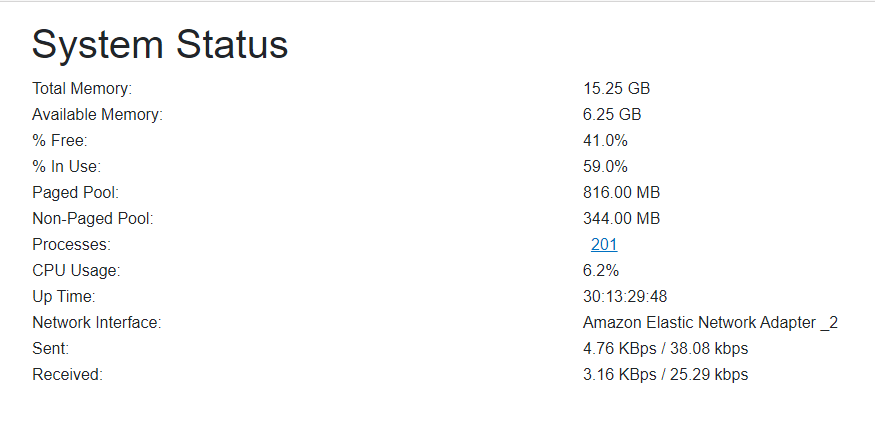

# IIGO Panel

Self-hosted ASP.NET application using Blazor. Designed to work on Windows Server 2012 and newer.

Windows Server 2012 may require installing Microsoft Visual C++ 2015-2019 Redistributable:

* [VC 2015 x64](https://aka.ms/vs/16/release/vc_redist.x64.exe)
* [VC 2015 x86](https://aka.ms/vs/16/release/vc_redist.x86.exe)

## Early access

Gain early access and prioritized features and issues with private discussions: [https://github.com/sponsors/ahwm](https://github.com/sponsors/ahwm)

## Features

* System Status (RAM/CPU/Network Usage, Processes, System Uptime)
* Windows Update
* Firewall Management
* Task Scheduler
* Notifications via:
  * Discord
  * Google Chat
  * Postmark
  * Amazon SES
  * Amazon SNS
  * SendGrid
  * Slack
  * Basic SMTP
* IIS Management (including most administration capabilities from the IIS Console such as Website and Application Pool management)
  * IIS Application Pool Monitoring (including restarting stopped app pools with configurable notifications)

## Screenshots

